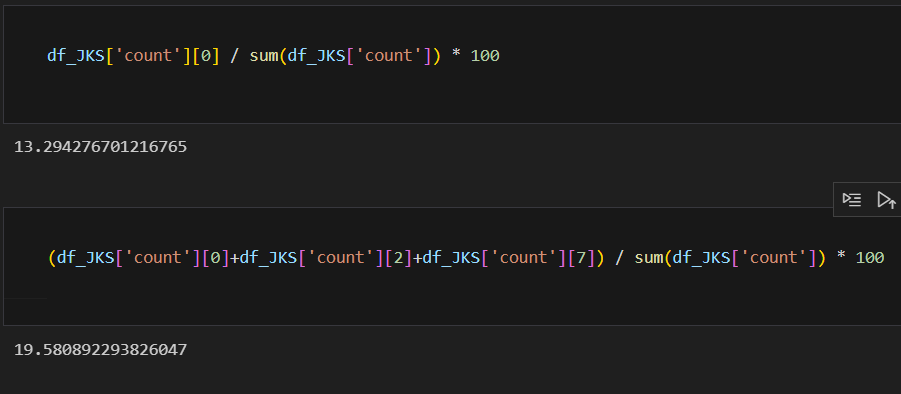
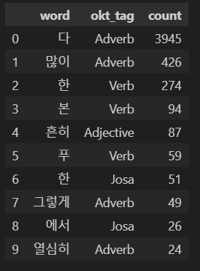
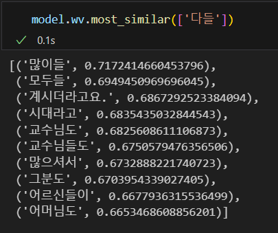
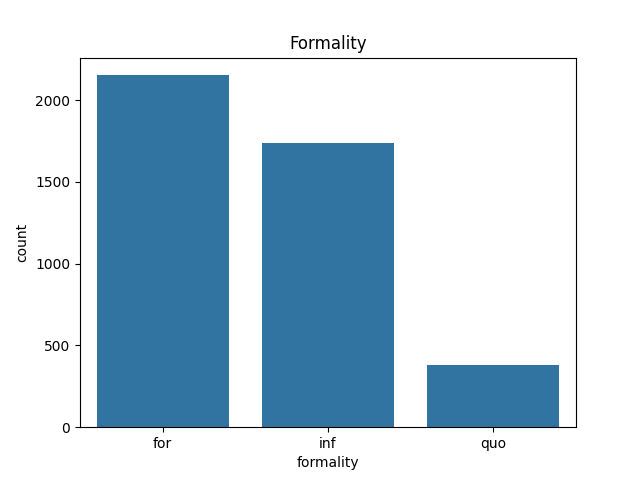
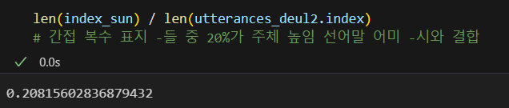
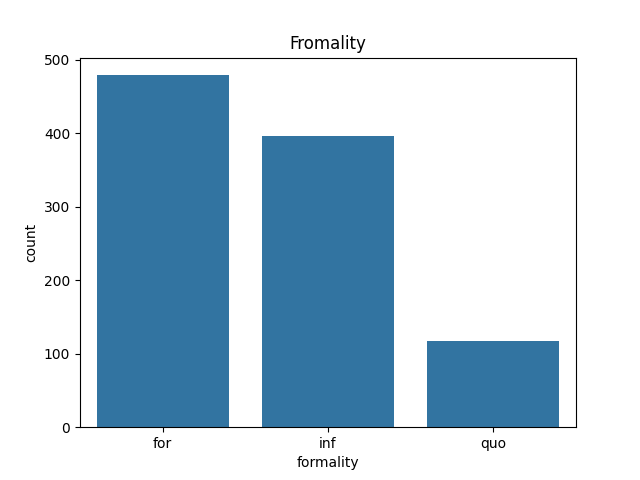
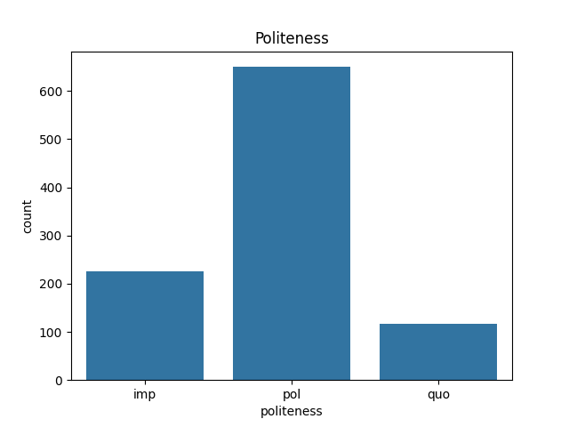

2023-2 언어데이터과학 기말프로젝트 최종보고서

# 한국어 간접 복수 표지 '-들'의 결합 조건 분석을 위한 '모두의 말뭉치' 활용

2021-12659 박유나

## 1 서론

### 1.1 연구 목적

이 프로젝트의 목적은 간접 복수 표지 '-들'의 결합 요건으로 제시된 여러 가설들을 코퍼스를 활용하여 검증하는 것이다.

### 1.2 연구 계획 대비 목표 달성 결과

||계획|실행|결과|
|--|--|--|--|
데이터 수집| [[모두의 말뭉치]] 중 [국회 회의록 말뭉치 2021]과 [일상 대화 말뭉치 2021] 다운로드. | [[모두의 말뭉치]] 중  [국회 회의록 말뭉치 2021]과 [일상 대화 말뭉치 2021], [일상 대화 말뭉치 2020]을 다운로드함.|전체 달성|
|데이터 가공| JSON 파일 --> 데이터프레임 변환.| 1. pandas를 사용하여 실행함. [[코드](../project.ipynb)]의 Preprocessing 부분 2. 데이터프레임이 구축되면 pandas 라이브러리와 정규표현식, 형태소 분석기를 사용하여 발화 형태로부터 '들'이 직접 복수 표지가 아닌 간접 복수 표지로만 사용된 문장만을 추출할 수 있다. [[코드](../project.ipynb)]의 Filtering 부분. 3. 형태소 분석기를 활용하여 품사 태그가 결합된 데이터 프레임을 만든다. [[코드](../project.ipynb)]의 Tag 부분.|전체 달성|
|데이터 활용| 간접 복수 표지 '-들'이 나타내는 화용적 의미를 종결표현을 통해 확인한다. | 간접 복수 표지 '-들'의 결합 요건으로 제시된 집단성, 배분성, 격식성을 분석함. | 초과 달성|

## 2 연구 방법

### 2.1 코퍼스

여러 코퍼스 중 [국회 회의록 말뭉치 2021], [일상 대화 말뭉치 2021], [일상 대화 말뭉치 2020]를 선정하였는데 그 이유로는 복수 표지는 주로 구어 상황에서 화용적 의미를 전달하므로, 구어 데이터로 구성되고 발화자들이 공손성과 격식성 모두를 확인할 수 있는 관계여야 하기 때문이다.

[[모두의 말뭉치]] [일상 대화 말뭉치 2021]는 일상 대화 자료를 한글로 전사가 저장된 4,143개의 JSON 파일로 이루어져 있으며, 전체 크기는 560MB이다.

[[모두의 말뭉치]] [일상 대화 말뭉치 2020]는 일상 대화 자료를 한글로 전사가 저장된 2,232개의 JSON 파일로 이루어져 있으며, 전체 크기는 327MB이다.

[[모두의 말뭉치]] [국회 회의록 2021]는 일상 대화 자료를 한글로 전사가 저장된 5,395개의 JSON 파일로 이루어져 있으며, 전체 크기는 303MB이다.

### 2.2 데이터 가공

[[코드](../project.ipynb)] Preprocessing

    코퍼스에서 제공하는 데이터의 속성(attribute) 중 form만을 선택하여 5,514,111건의 데이터를 데이터프레임으로 저장했다. 

[[코드](../project.ipynb)] Filtering

    - 데이터의 크기가 매우 크기에 우선 크기를 대폭 줄이기 위해 다음으로 정규표현식을 이용하여 '-들'이 출현한 경우만을 수집하였다. 그리고 한 행에 여러 문장이 있는 경우가 있으므로 분리한 후 다시 '-들'이 출현한 경우만을 수집하였다. '-들'이 간접 복수 표지로 사용된 경우만을 추출하기 위해 형태소 분석기를 사용하였다.
    - okt의 품사태깅에 따르면 'Suffix'로 분류되는 직접 복수 표지 '-들'과 달리 간접 복수 표지 '-들'은 'Verb'로 분류가 됨을 이용하여 1차 필터링을 실시하였다.
    - 많이 발견되지만 okt가 분류하지 못한 직접 복수 표지 '님들'과 '네들'과 '생각이 들'처럼 동사 '든다'의 활용형으로서 '들'이 사용된 경우를 수작업으로 제거하였다.
    - 그 결과 5,640개의 문장을 얻을 수 있었다.

[[코드](../project.ipynb)] Tag

    추후 데이터 분석에서 활용하기 위해 okt와 꼬꼬마 형태소 분석기의 품사태깅 정보를 추가하였다. 

이 과정에서 얻은 데이터 파일은 아래와 같다.

+ [[데이터 파일(발화)](https://drive.google.com/file/d/1L2LAeMjzE4YbqzQsEEaC5tuw5Xklzayb/view?usp=sharing)]
+ [[데이터 파일(간접 복수 표지 '-들'이 나타난 문장)](../../data/deul.csv)]

## 3 연구 결과
간접 복수 표지 '-들'의 결합 요건으로 제시된 여러 가설들을 검토하고 데이터를 활용해 검증해보았다.

### 3.1 집단성
간접 복수 표지 '-들'의 출현 조건이 복수표지 복사(plural marking copying)라는 견해가 있었다. 즉 주어에 실현된 복수 표지가 문장 내의 다른 성분에 수의적으로 복사되어 체언이 아닌 경우에도 '-들'이 결합된다는 설명이다.(박소영, 2020) 이러한 설명에 따르면 간접 복수 표지 '-들'의 사용에는 복수형의 주어가 전제되어 있다. 주어가 복수형이 아니더라도 문장 전반에서 집단성이 확인되야 한다.(홍영애, 2021)

#### 주어
[[코드](../project.ipynb)] 주어

| 
---|---|

위의 표는 간접 복수 표지 '-들'이 나타난 문장에 나타난 주어의 출현 횟수에 따라 상위 10개만을 출력한 표이다. 주어만을 수집 위해 품사 태깅 정보를 활용하여 주격조사 이/가와 결합하는 단어를 추출하였다. 흥미롭게도 직접 복수 표지 '-들'이 가장 많이 나타났다. 

위의 그림은 복수성을 띈다고 볼 수 있는 단어들의 출현 빈도를 출력하는 코드이다. 약 13%가 주어에 직접 복수 표지 '-들'이 나타났으며, 한국어의 경우에는 복수성이 명시적으로 들어나지 않기에 복수성이 있다고 볼 수 있는 '너희'와 '우리'까지 추가하였을 때는 약 19.5%를 차지했다. 

간접 복수 표지 '-들'이 나타난 문장에서 주어로 활용된 단어의 총 개수는 930개이다. 이와 더불어 앞서 언급했둣 한국어의 경우 복수성이 명시적으로 드러나지 않음을 고려할 때, 3개의 단어가 전체의 19.5%를 차지하는 것은 간접 복수 표지 '-들'의 출현에 주어의 복수성이 영향을 준다고 볼 수 있다.

#### 들과 결합하는 단어
[[코드](../project.ipynb)] Counting

|
---|---|

주어가 복수형이 아니더라도 문장 전반에서 집단성이 확인되야 한다는 주장에 따라, '-들'이 결합하는 단어에서도 집단성이 발견되는지 확인하여 보았다. 

위의 표는 간접 복수 표지 '-들'과 결합하는 즉, '00들' 꼴의 단어 중 00을 출현 횟수에 따라 10개만을 출력한 표이다. 집단성이 있다고 볼 수 있는 '많이'와 '다'가 가장 많이 사용된 것을 볼 수 있다.

위의 그림은 '많이들'과 '다들'의 빈도를 출력하는 코드이다. ‘다들’과 ‘많이들’은 76%를 차지하였다. 특히나, '다들'이 68%로 압도적으로 많이 사용되었다. 따라서 다들에 관해서 아래에서 더 알아보았다.

#### 다들
[[코드](../project.ipynb)] 다들

'다들 그래.', '다들 드세요' 등 '다들'이 나타난 문장에서 '다'는 *'다는 그래.' *'다는 드세요' 등이 어색함을 보았을 때 부사로 활용됨이 분명하다. 허나, 부사적 쓰임을 보이는 '다 드세요.', '다 그래'에서와 달리 다들을 사용하였을 때는 그것이 지시하는 바가 청자 전체나 다수의 사람들을 의미한다. 더불어 앞선 장에서 보았듯 '다들'은 다른 단어들과 달리 압도적인 사용량을 보여준다.

따라서 다들이 '(부사)다 + 들'이 아닌 새로운 단어가 만들어진 것이 아닐까 추측하였다. 이를 확인하기 위해 Word2vec을 이용하여 수집한 발화데이터 파일을 훈련 시킨 뒤, '다들'과 유사하게 사용되는 단어 10개를 출력하였다. 그 결과가 위의 그림과 같다. '다들'과 유사하게 사용되는 단어 10개 중 6개(모두들, 교수님도, 교수님들도, 그분도, 어르신들이, 어머님도)가 명사임을 확인할 수 있었다. 하지만 *'다들이 드세요., 다들은 그래' 등 '다들'에 주격조사가 결합한 형태가 비문임을 고려하면 '다들'이 명사화되었다기엔 무리가 있어 보인다. '다들'의 사용에 대해서는 더 연구해 볼만 하다고 생각한다. 

### 3.2 배분성
[[코드](../project.ipynb)] 배분 부사

(박소영, 2020)에 따르면 배분적 속성이 간접 복수 표지 ‘-들’의 다양한 의미적 역할과 기능 중에서 문장의 의미 해석에 중점적으로 영향을 끼친다고 말하며, 간접 복수 표지 ‘-들’은 그것이 결합한 성분이 나타내는 사물, 행위, 방법, 관련사건 등이 문장 내 주어가 표지하는 행위자들에게 배분되는 역할을 한다고 주장한다.

배분성을 확인하기 위해 배분 표지라 할 수 있는 간접 복수 표지 '-들'이 나타난 문장 중 '각자, 각각, 마다, 씩, 끼리'가 나타난 빈도를 구하였다. 그 결과는 2.8%로, 매우 한정된 배분표지이긴 하나 집단성에 비해 약한 결과를 보였다. 

### 3.3 종결 표현
[[코드](../project.ipynb)] 종결 표현

많은 언어에서 복수표현이 화용적인 의미를 담고 있는 경우가 발견되며, 특히 공손성을 표현하는데 많이 활용된다. 한국어에서도 복수표현 ‘-들, -네, 따위’ 등이 비복수적 의미나 화용적 의미를 나타낸다. 그렇지만 이들은 복수성과 공손성의 관계만으로 설명되지 않는다. (정상희, 2016)은 복수표현들의 결합에 있어, 문법성과 비문법성을 결정짓는 것은 공손성이라기보다 격식성이라고 설명한다. 간접 복수 표지 '-들'은 공손한 상황에서가 아니라 격식적이지 않은 상황에서 사용된다고 말한다.

분석 방법:

    꼬꼬마의 품사태깅 결과에 따라 종결표현(EF)만을 추출한 뒤, 종결표현에 실현되는 상대높임법을 이용하여 격식성과 공손성을 분류한다. 
    격식적인 상황은 [격식성+ : for]이며, 비격식적인 상황은 [격식성- : inf]이다.
    공손한 상황은 [공손성+ : pol]이며, 공손하지 않은 상황은 [공손성- : imp]이다.
    상대 높임법에 따른 분류는 다음와 같다. (하십시오, 하오 : 격식성+ 공손성+ / 하게, 해 : 격식성+ 공손성-/ 해요 : 격식성- 공손성+/ 해 격식성- 공손성-) 
    상대높임법을 분류하여주는 분석기를 발견하지 못하였기에 특징이 분명한 하십시오체와 해요체를 제외하고는 수작업으로 분류하였다. 이는 분석가의 자의적인 판단이 개입하였다는 점에서 한계가 있다.

결과:

|
---|---|

	(정상희, 2016)의 주장처럼 격식성이 간접 복수 표지 '-들'의 결합에 영향을 미친다면, 격식성에서의 변화가 두드러지게 나타나야한다. 그러나 격식성과 공손성의 각각의 구분에 따른 문장 수를 보여주는 위 그래프에서는 격식성에서 [격식성+]와 [격식성-]는 큰 차이가 없는 반면 공손성에서 [공손성+]와 [공손성-]는 큰 차이를 보임을 확인할 수 있다. 이를 통해  ‘-들’이 나타내는 화용적 의미는 [격식성-]보다 [공손성+]인듯 하다.
 
    

    더불어서, 위 그림은 간접 복수 표지 ‘-들’이 나타난 문장 중 주체 높임 선어말어미 ‘-시’가 나타난 문장의 빈도이다. 전체의 20%는 무시할 수 없는 정도이며, 주체 높임 선어말어미 역시 공손성과 관련있다고 볼 수 있다.

#### 집단성 제거
[[코드](../project.ipynb)] 집단성 제거

위의 논의들에 따르면 간접 복수 표지 '-들'은 집단성과 공손성에 영향을 받는 듯 하다. (정상희, 2016)은 집단성이 없는 경우에 한해 간접 복수 표지 '-들'의 출현 원인을 분석하였으므로 해당 논문의 예시들과 마찬가지로 집단성을 제거하고 종결 표현을 분석해보았다. 집단성 제거는 '다들, 많이들'이 나타난 경우와 '-들'이 okt의 품사 태깅 결과 Suffix로 분류되는 경우를 제외하는 방식으로 이루어졌으며, 결과적으로 992개의 문장을 얻을 수 있었다.

|
---|---|

집단성을 제거하지 않은 위의 그래프와 모양의 차이가 없음을 확인할 수 있다. 즉, 집단성과 관계없이 공손하지 않은 상황보다 공손한 상황에서 간접 복수 표지 '-들'이 출현한다.

## 4 결론

이 연구에서는 [[모두의 말뭉치]]에서 제공하는 구어 데이터를 활용하여 선행 연구들이 제시한 간접 복수 표지 '-들'의 출현 조건을 검토하였다.

선형 연구들에서 제시하는 조건은 총 세가지로 집단성, 배분성, 격식성이 그것이다. 우선 집단성의 경우에는 주어와 들과 결합하는 단어 모두에서 복수성 및 집단성이 유의미한 정도로 발견되었다. 반면 배분성의 경우에는 배분 표지의 출현 빈도가 집단성을 나타내는 단어들에 비해 현저히 낮았다. 마지막으로 격식성의 경우에는 비격식성이 간접 복수 표지 '-들'의 결합 조건이라던 선행 연구와는 달리 공손성에 있어서 공손한 상황에서의 사용이 두드러지게 나타났다.

이에 더해 '다들'의 많은 사용량으로부터 '(부사)다 + 들'가 아닌 새로운 쓰임을 보인다는 발견을 하였다.

추후 연구로는 위에서 언급한 '다들'의 형태론적 분석 혹은 간접 복수 표지 '-들'의 사용에 있어 집단성과 공손성 중 더 핵심적인 것이 무엇인지 비교할 있을 듯 하다.

## 참고 문헌
- 홍영예. (2021). 우리말의 복수 표지 ‘-들’에 관한 소고. 어학연구, 57(3), 225-243.
- 박소영. (2020). 간접복수 ‘들’의 실현: 음성형식부 일치 현상. 언어학, 88, 91-113.
- 정상희. (2016). 복수 표현의 복수성과 화용적 의미. 한국어 의미학, 52, 31-59.