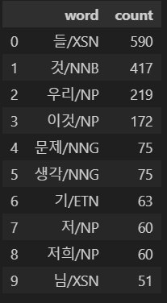
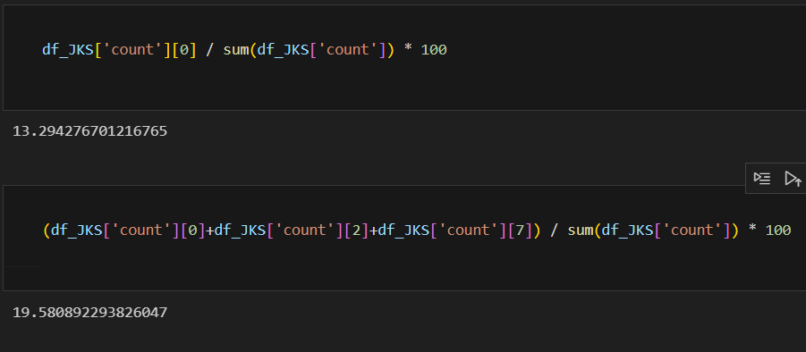
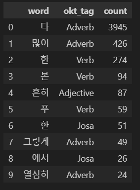
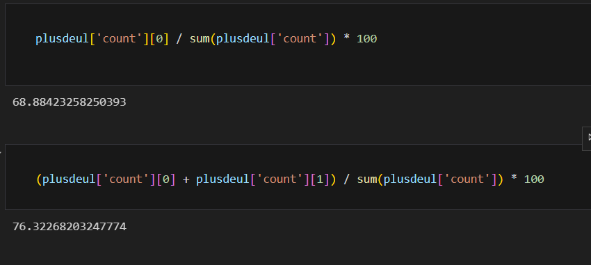
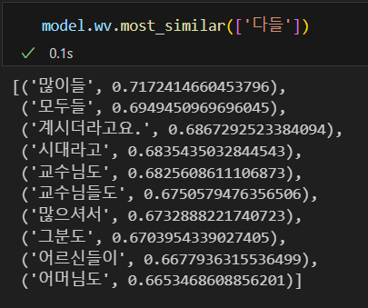
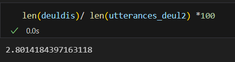
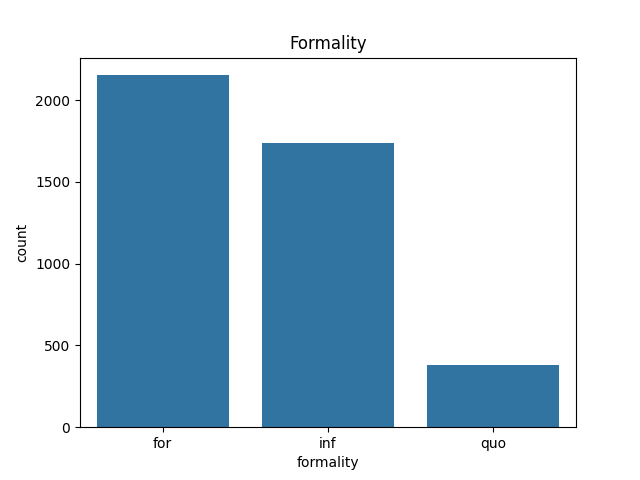
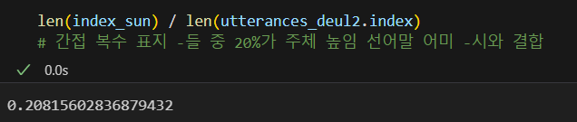
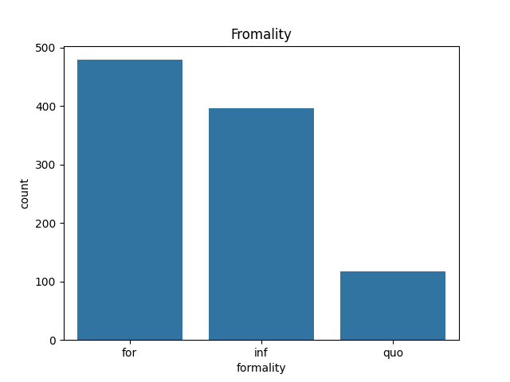
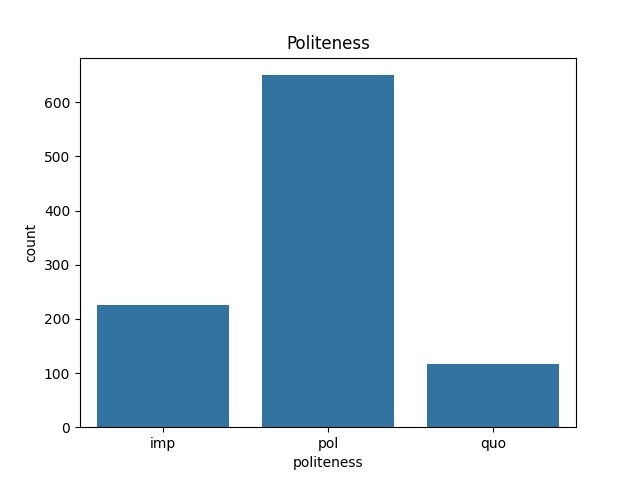

2023-2 언어데이터과학 기말프로젝트

# 간접 복수 표지  '들'의 결합 조건 분석
2021-12659 박유나

# Preprocessing

모두의 말뭉치의 구어성을 지닌 코퍼스 [일상 대화 말뭉치 2020]과 [일상대화 말뭉치 2021] [국회 회의록 말뭉치2021] 에서 얻은 5514111개의 문장 중 ‘-들’이 간접 복수표지로 활용된 5640개의 문장을 추출함

 | 
---|---|

부사의 경우 token은 높지만 type은 낮음. 특정 몇개의 단어만 ‘들’이 많이 결합한다. 동사에 붙을 수 있는 경우는 다양하다.

# Checking condition
## 집단성
복수표지 복사(plural marking copying, Song 1975)라는 견해가 있었다. 즉 주어에 실현된 복수 표지가 문장 내의 다른 성분에 수의적으로 복사된다/(박소영, 2020) 간접 복수 표지 들에는 복수형의 주어가 전제되어 있다. 주어가 복수형이 아니더라도 문장 전반에서 집단성이 확인되야 한다.(홍영애, 2021)

###	주어
|
---|---|

간접복수표지 들이 나타난 문장중 주격조사 이/가와 결합하는 단어를 분석하였다. 약 13%가 주어에 복수표지 -들이 사용되었다. 한국어의 경우에는 복수성이 명시적으로 들어나지 않기에 집단적 명사를 추가한 경우에는 약 19.5%가 이에 해당하였다. 주어의 복수형이 들에 영향을 끼친다고 볼 수 있다. 
	주어 위치에 온 단어들의 type이 930임을 고려할 때, 3개 단어가 18.5%를 차지하는 것은 간접 복수 표지 사용에 -들이 영향을 준다고 볼 수 있다.

### 들과 결합하는 단어
|
---|---|

문장 전반에서 집단성이 확인된다면, 들이 결합하는 단어에서도 집단성을 파악할 수 있을 것이다. 00들 꼴의 단어중 다들이 68%였으며, ‘다들’과 ‘많이들’이 76%를 차지하였다. ‘다’와 ‘많이’모두 집단성을 지녔다고 볼 수 있다.

### 다들

다들이 부사구가 아니라 청자 전체를 지칭하는 명사가 되었다..? 하지만… 조사 결합이 불가능… 
하지만 주어들과 유사성을 지님 ...?

## 배분성
이러한 간접 복수 표지 ‘-들’의 다양한 의미적 역할과 기능 중에서 문장의 의미 해석에 중점적으로 영향을 끼치는 것은 배분적 속성이었다. 즉, 간접 복수 표지 ‘-들’은 그것이 결합한 성분이 나타내는 사물, 행위, 방법, 관련사건 등이 문장 내 주어가 표지하는 행위자들에게 배분되는 역할을 한다. 이를 통해 복수적 주어가 나타내는 행위자의 집단적 행위가 개체화, 개별화를 겪으면서 문장에 배분적 의미가 부여 된다 (박소영, 2020).

간접 복수표지 들이 배분성을 지닌 부사 '각자, 각각, 마다, 씩, 끼리'와 사용되는 경우는 2.8%에 불과 

## 종결 표현
복수표현이 화용적인 의미를 담당하는 것은 많은 언어에서 발견되며, 특히 공손성을 표현하는데 많이 활용된다. 한국어에서도 복수표현 ‘-들, -네, 따위’ 등이 비복수적 의미나 화용적 의미를 나타낸다. 그렇지만 이들은 복수성과 공손성의 관계만으로 설명되지 않는다. (정상희 2016)은 복수표현들의 결합에 있어, 문법성과 비문법성을 결정짓는 것은 공손성이라기 보다는 격식성이라고 설명한다.

- 분석 방법:

    종결표현에 실현되는 상대높임법에 따라 격식성과 공손성을 확인한다. (하십시오 / 하오 : 격식성+ 공손성+, 하게 / 해 : 격식성+ 공손성-, 해요 : 격식성- 공손성+, 해 격식성- 공손성-)
    격식성+ for 격식성- inf / 공손성+ pol 공손성- imp 
    특징이 분명한 하십시오체와 해요체를 제외하고는 수작업으로 분류.. 자의적인 판단이 개입하기에 오류가 있을 수 있다는 한계 존재

- 결과:

|
---|---|

	격식성에서 [격식성+]와 [격식성-]는 큰 차이가 없는 반면 공손성에서 [공손성+]와 [공손성-]는 큰 차이를 보인다. ‘-들’이 나타내는 화용적 의미는 [격식성-]보다 [공손성+]인듯 하다.
 
    

    ‘-들’이 나타난 문장 중 약 20%에서 주체 높임 선어말어미 ‘-시’가 나타난다. 이 역시 공손성과 관련있다고 볼 수 있을 듯하다.

### 집단성 배제

들은 주어에 집단성이 없는 경우에도 나타난다. 이경우엔 화용적의미가 다르게 나타나지 않을까? 다들, 많이들과 결합한 경우와 들이 suffix로 나타난 경우를 제외하고 공손성과 격식성을 비교하였다.
|
---|---|

차이가 없다.

# References
- 홍영예. (2021). 우리말의 복수 표지 ‘-들’에 관한 소고. 어학연구, 57(3), 225-243.
- 박소영. (2020). 간접복수 ‘들’의 실현: 음성형식부 일치 현상. 언어학, 88, 91-113.
- 정상희. (2016). 복수 표현의 복수성과 화용적 의미. 한국어 의미학, 52, 31-59.

